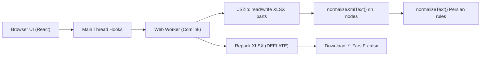

# FarsiFix

Normalize Persian text in Excel (`.xlsx`) files for reliable search/filter behavior, without breaking workbook structure.

FarsiFix is a client-side web app: files are processed locally in your browser using a Web Worker. No server upload is required.

## Why FarsiFix

Mixed Arabic/Persian code points in spreadsheet text can make filters and lookups fail even when words look identical. FarsiFix standardizes those text variants while keeping formulas, styles, and workbook structure intact.

## What It Does

- Normalizes Persian text in `xl/sharedStrings.xml`.
- Normalizes inline string cells inside `xl/worksheets/sheet*.xml`.
- Preserves XML entities (`&amp;`, `&lt;`, `&gt;`, `&quot;`, `&apos;`) exactly as encoded.
- Leaves non-text XML untouched (including formulas and formatting tags).
- Produces a download named `<original>_FarsiFix.xlsx`.

## Supported Files

- Input: `.xlsx`
- Output: `.xlsx` (same workbook structure, normalized text nodes)

## Normalization Rules (Current)

- Arabic/Persian letter variants are canonicalized (for example `ك` -> `ک`, `ي/ى` -> `ی`).
- Persian and Arabic-Indic digits are normalized to ASCII (`۱۲۳٤٥` -> `12345`).
- ZWNJ (`\u200c`) is mapped to a space in default mode.
- Horizontal whitespace is collapsed per line, while newline structure is preserved.
- Urdu full stop `۔` is normalized to `.`.
- Latin text casing is preserved (no case folding).

Example:

| Input | Output |
| --- | --- |
| `كريم` | `کریم` |
| `سلام &amp; دنيا` | `سلام &amp; دنیا` |
| `می‌روم` | `می روم` |
| `۱۲۳٤٥٦` | `123456` |

## Safety & Integrity Guarantees

FarsiFix follows strict XML invariants:

- Never decode/re-encode XML entities.
- Use regex-based string surgery only (no DOM parsing/reserialization).
- Normalize text only inside `<t>` tags.
- Preserve tag attributes such as `xml:space="preserve"`.

Guardrails:

- UI rejects files larger than `VITE_MAX_FILE_SIZE_MB` (default `100` MB).
- Worker aborts when `xl/sharedStrings.xml` exceeds `200` MB (unzipped).
- Worker aborts when any `xl/worksheets/sheet*.xml` exceeds `50` MB (unzipped).

## Architecture



## Tech Stack

- React 19 + TypeScript + Vite
- Tailwind CSS v4
- Web Workers + Comlink
- JSZip for `.xlsx` package manipulation
- Vitest (unit) + Playwright (E2E)
- Biome + Oxlint

## Quick Start

### 1) Install

```bash
npm install
```

### 2) Run Development Server

```bash
npm run dev
```

Open [http://localhost:5173](http://localhost:5173).

### 3) Build Production Assets

```bash
npm run build
```

## Scripts

- `npm run dev` - Start Vite dev server.
- `npm run build` - Typecheck and build.
- `npm run preview:local` - Preview production build locally.
- `npm run typecheck` - TypeScript checks only.
- `npm run test` - Run Vitest unit tests.
- `npm run test:watch` - Run unit tests in watch mode.
- `npm run e2e` - Run Playwright end-to-end tests.
- `npm run perf:metrics` - Build + run Lighthouse (mobile/desktop) and save normalized metrics JSON/Markdown.
- `npm run perf:compare` - Compare two metrics JSON files and produce a before/after Markdown report.
- `npm run lint` - Run Biome checks.
- `npm run lint:fix` - Apply Biome fixes.
- `npm run lint:ox` - Run Oxlint (type-aware).
- `npm run lint:all` - Run Biome + Oxlint.
- `npm run check:theme` - Verify class-based dark mode in built CSS.
- `npm run view` - Open a headed Playwright session against dev server.
- `npm run deploy:pages` - Build and deploy to Cloudflare Pages.

## Performance Metrics (Before/After)

Collect a normalized performance snapshot (Lighthouse mobile + desktop):

```bash
npm run perf:metrics -- --out output/perf/before.json --raw-dir output/perf/raw-before
```

Run again after your changes:

```bash
npm run perf:metrics -- --out output/perf/after.json --raw-dir output/perf/raw-after
```

Generate the before/after report:

```bash
npm run perf:compare -- --before output/perf/before.json --after output/perf/after.json --out output/perf/report.md
```

Fail on regressions (useful in CI):

```bash
npm run perf:compare -- --before output/perf/before.json --after output/perf/after.json --fail-on-regression
```

GitHub Actions workflow is included at `.github/workflows/perf-regression.yml` and runs this flow on pull requests.

## Environment

`.env`:

```env
VITE_MAX_FILE_SIZE_MB=100
```

## Quality Gate (Recommended Before Merge)

```bash
npm run lint:all
npm run build
npm run test
npm run e2e
npm run check:theme
```

## Project Layout

```text
src/
  components/      UI
  hooks/           App/worker orchestration
  lib/             Pure normalization and utilities
  workers/         Worker entrypoint + Excel core logic
e2e/               Playwright specs
fixtures/          Test workbook fixtures
scripts/           Local tooling and checks
```

## Deployment

Cloudflare Pages config is included via `wrangler.toml`.

```bash
npm run deploy:pages
```

## Legacy Artifacts

The repository also contains a Python normalizer and keyboard mapping XML files used as historical/reference material during rule design:

- `persian_normalizer.py`
- `tests/test_normalizer.py`
- `persian-legacy.xml`
- `persian-standard.xml`

The production web app is implemented in TypeScript under `src/`.
